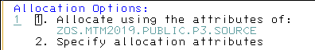

 # How to learn Assembly for IBM Z

Available online courses allow You to earn IBM badges, but these courses are rather expensive.

I am trying to use the book
Assembler Language Programming for IBM z System Servers Version 2.00 John R. Ehrman, 
documenting here what I am doing so others should be able to reproduce my steps.

## Get an account on a IBM Z computer

Access [Master the Mainframe](https://www.ibm.com/it-infrastructure/z/education/master-the-mainframe)
and click "Try the Learning System"

Fill in the form and submit.

IBM will send You an email with instructions how to connect and log on.

Follow the instructions and complete Part One. Almost everything You learn in Part One
is needed to be able to do work with assembly.

[Challenge 10 of Part 3 of MTM](http://mtm2019.mybluemix.net/part_three/part_three_ch10.html)
teaches how to use the assembler. I encorage You to follow through Part 2 and even complete
Part 3. You will learn a lot of interesting things and earn bagdes. However, if You are
only interested in assembly programming, the following section will tell You how to skip
Part 2 and Part 3 challenges.

## Run Your first assembly program

### Copy existing assembly file

As instructed in Challenge 10 of Part 3 one needs to copy an already existing assembly file to Your personal datset. Here are the detailed steps with screenshots how to do this.

In the ISPF panel write into the Option field:
`dslist  'zos.mtm2019.public.p3.source'`

and hit ENTER. A new panel appears.

Hit TAB twice to get at the start of the next line and write letter `b`

and hit ENTER. You will see a listing of dataset members.
Use TAB to get at the start of the line which reads `ASMHELLO` and write letter `c`.

Hit ENTER. A new panel appears. Look for the field labeled `Dataset Name`
and type in `SOURCE`.

Hit ENTER and then select option 1.

Hit ENTER. The dataset member list reappears. In the Command field write `dslist source`.

and hit ENTER. You are now in You own user area,
so Your user ID will appear where You can see `Z#####` in the screenshots here.

Hit TAB twice and write letter `e`.

Hit TAB twice again until You get at the start of the line which reads `ASMHELLO` and write letter `e`.

Hit ENTER. You are now using the editor. Here You could edit the file moving the cursor arround overtyping things. There are are many usefull editor commands. You can hit F1 to get help or google them. However, I will not modify the assembly code at this moment.

Call the assembler from the editor Command line: 
`submit; =sd ; st` 
and hit ENTER.

At the *** prompt hit ENTER again.

In the ST command line type: `PREFIX 'a*'` 
and ENTER

Hit TAB until You get at the start of the line which reads `ASMHELLO` and write a `?` 

and hit ENTER. A new panel with a listing appears.

Use TAB to get at the start o each line, write letter `v` and hit ENTER to view.

From here on You can follow the item 
*Identify reason assembler program compile was unsuccessful*
from [Challenge 10 of Part 3 of MTM](http://mtm2019.mybluemix.net/part_three/part_three_ch10.html)

For more Assembly program examples: [Run the first example from Git](https://github.com/klausmelcher/Learn-Assembly-with-IBM-Z-OS/blob/master/JRETEST.mkd) 

External Link with additional content: [ASSEMBLY LANGUAGE (CS-310)](http://www.wiu.edu/users/mflll/cs310/head.html)

