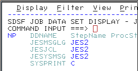

# How to learn Assembly for IBM System Z

Available online courses allow You to earn IBM badges, but these courses are rather expensive.

I am trying to use the book
"Assembler Language Programming for IBM z System Servers" Version 2.00 by John R. Ehrman, documenting here what I am doing so others should be able to reproduce my steps.

## Get an account on a IBM Z computer

Instead of using an Emulator on PC, I prefer using the real thing.
IBM kindly offers access to a real System Z mainframe computer for anyboddy who wants to learn how to use it.

Access [Master the Mainframe](https://www.ibm.com/it-infrastructure/z/education/master-the-mainframe)
and click "Try the Learning System"

Fill in the form and submit.

IBM will send You an email with instructions how to connect and log on.

Follow the instructions and complete Part One. Almost everything You learn in Part One
is needed to be able to do work with assembly.

[Challenge 10 of Part 3 of MTM](http://mtm2019.mybluemix.net/part_three/part_three_ch10.html)
teaches how to use the assembler. I encorage You to follow through Part 2 and even complete
Part 3. You will learn a lot of interesting things and earn bagdes. However, if You are
only interested in assembly programming, the following section will tell You how to skip
Part 2 and Part 3 challenges.

## Run Your first assembly program

### Copy existing assembly file

As instructed in Challenge 10 of Part 3 one needs to copy an already existing assembly file to Your personal datset. Here are the detailed steps with screenshots how to do this.

In the ISPF panel write into the Option field: 
`tso sub 'zos.public.jcl(part3)'`

When asked to `ENTER JOBNAME CHARACTER(S)` type any letter and hit ENTER.

At each *** prompt hit ENTER.

After coming back to the ISPF panel write into the Option field:
`dslist  'zos.mtm2019.public.p3.source'`

and hit ENTER. A new panel appears.

Hit TAB twice to get at the start of the next line and write letter `b`

and hit ENTER. You will see a listing of dataset members.
Use TAB to get at the start of the line which reads `ASMHELLO` and write letter `c`.

Hit ENTER. A new panel appears. Look for the field labeled `Dataset Name`
and type in `SOURCE`.

Hit ENTER. Then in the Command field write `dslist source`.

and hit ENTER. You are now in You own user area,
so Your user ID will appear where You can see `Z#####` in the screenshots here.

### Open the copied file in the editor

Hit TAB twice and write letter `e`.

Hit TAB twice again until You get at the start of the line which reads `ASMHELLO` and write letter `e`.

Hit ENTER. You are now using the editor. Here You could edit the file moving the cursor arround overtyping things. There are are many usefull editor commands. You can hit F1 to get help or google them. However, I will not modify the assembly code at this moment.

### Assemble

Call the assembler from the editor Command line: 
`submit; =sd ; st` 
and hit ENTER.

At the *** prompt hit ENTER again.

In the ST command line type: `PREFIX *` 
and ENTER

Hit TAB until You get at the start of the line which reads `ASMHELLO` and write a `?` 

and hit ENTER. A new panel with a listing appears.

Use TAB to get at the start o each line, write letter `v` and hit ENTER to view.

From here on You can follow the item 
*Identify reason assembler program compile was unsuccessful*
from [Challenge 10 of Part 3 of MTM](http://mtm2019.mybluemix.net/part_three/part_three_ch10.html)

## Copy file from git repository to Z/OS data set

1. In Your Linux PC, enter the Terminal and install git (in Ubuntu `sudo apt install git`, in CentOS `sudo yum install git`
2. Use `git clone https://github.com/klausmelcher/Learn-Assembly-with-IBM-Z-OS.git` to create a working copy.
3. `cd Learn-Assembly-with-IBM-Z-OS`
4. Use scp to copy a file from Your Linux PC to Your MTM Unix account: 
    `scp JRETEST Z#####@192.86.32.91:` 
    substituting Z##### by Your user id.
5. Use ssh and cp to copy the file from Your MTM Unix area to Your data set: 
    `ssh Z#####@192.86.32.91 'cp JRETEST "//source(JRETEST)"'`

At step 5 an EDC5061I error may occur. In this case log off Your Z/OS
account using option 2 (delete files) and try again.

## Assemble and run

The assembler and linker is called the same way as in [Challenge 10 of Part 3 of MTM](http://mtm2019.mybluemix.net/part_three/part_three_ch10.html), but no additional command is needed to run the program.

 1. `dslist source` 
 2. use letter `e` to edit JRETEST
 3. `submit; =sd; st` 
 4. use `?` to look at the job outputs

The output generated by running the program can be found  in RECC.

## Copy file from Z/OS data set to git repository

1. Use ssh and cp to copy the file from data set to Unix: 
    `ssh Z#####@192.86.32.91 'rm -f JRETEST; cp "//source(JRETEST)" JRETEST'`
2. Use scp to copy a file from Unix account to Linux PC: 
    `scp Z#####@192.86.32.91:JRETEST .` 

# Exercises of the Book

Each subdirectory ChI, ChII, ChIII, etc. contains the exercises of the corresponding chapter of the book 
 "Assembler Language Programming for IBM z System Servers" by J. R. Ehrman.
   
The file names relate to the exercise numeration.

`EXXYYZZ` is for Exercise  X.Y.Z

for example,

`E020304` is for Exercise  2.3.4 (which can be found on page 21 of the book)

# Interesting Links

[Marist College Assembler resources](https://idcp.marist.edu/iw/assembler-resources), includes link to download the book

[Northern Illinois University Assembly course](http://faculty.cs.niu.edu/~hutchins/csci360/main.htm)

[Western Illinois University Assembly course](http://www.wiu.edu/users/mflll/cs310/head.html)

[ssh and scp without need to type password](http://www.linuxproblem.org/art_9.html)

[using 3270 terminal emulator from behind a firewall](http://labarc.ufcg.edu.br/loac/index.php?n=OAC.Telas#z)
